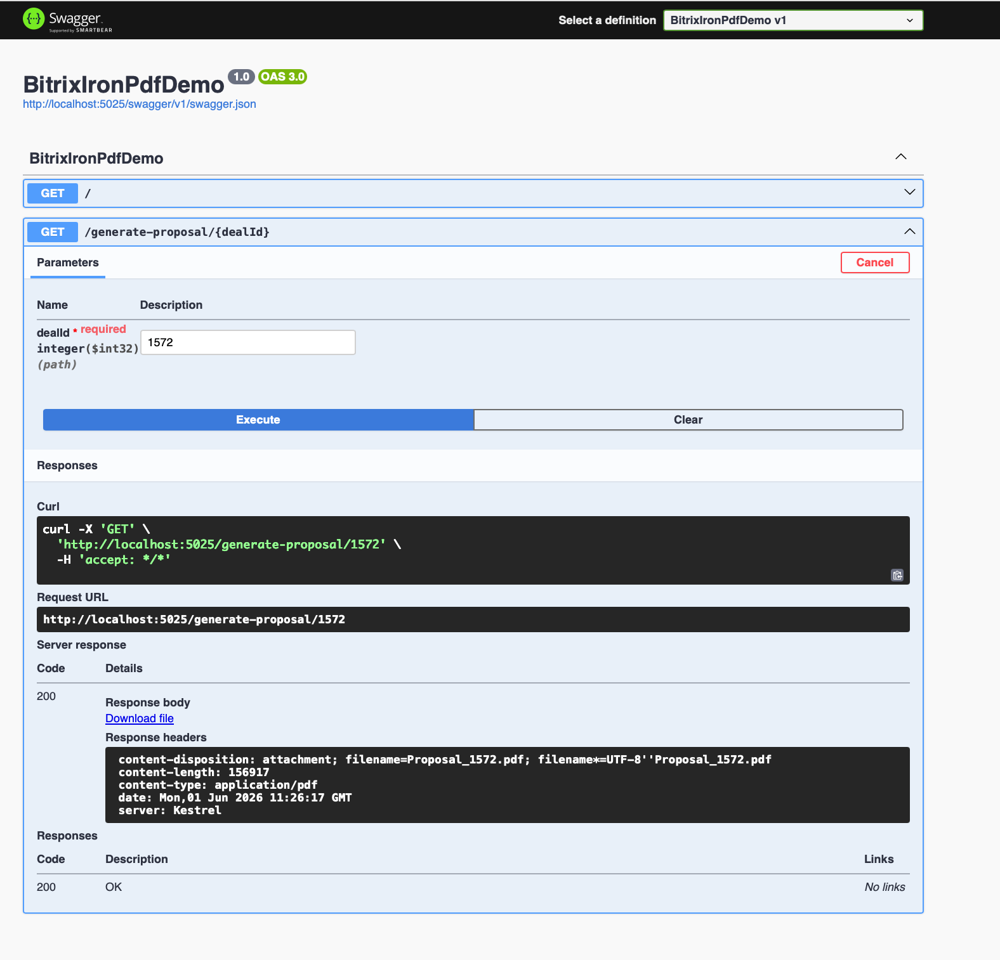
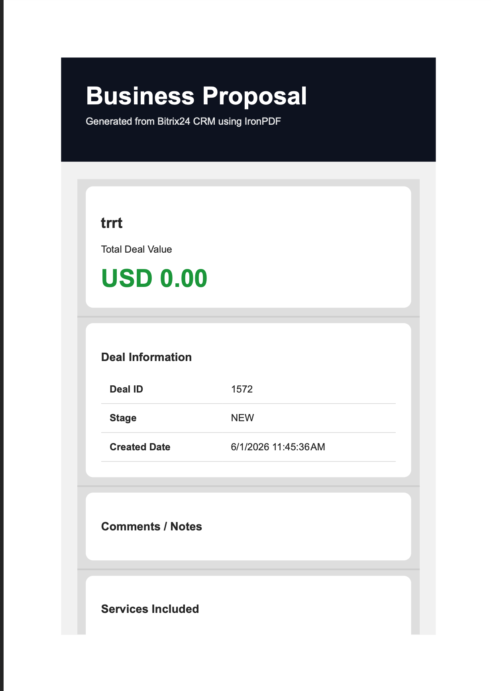

# Bitrix24 + IronPDF Proposal Generator API

A .NET 8 Web API project that integrates Bitrix24 CRM with IronPDF to automatically generate professional PDF proposals from CRM deal data.

---

## Features

- Fetch CRM deal data from Bitrix24
- Generate modern PDF proposals
- Swagger API testing
- HTML-to-PDF rendering using IronPDF
- Clean minimal API structure
- Production-ready configuration setup
- Secure license handling via appsettings

---

## Tech Stack

- .NET 8
- ASP.NET Core Minimal API
- IronPDF
- Bitrix24 REST API
- Swagger / OpenAPI

---

## Project Structure

```bash
Project/
│
├── Program.cs
├── appsettings.json
├── appsettings.example.json
├── GeneratedPDFs/
├── README.md
└── .gitignore
```

---

## Installation

### Clone Repository

```bash
git clone YOUR_GITHUB_REPO
```

### Install Packages

```bash
dotnet restore
```

### Configure Settings

Create:

```bash
appsettings.json
```

Example:

```json
{
  "IronPdf": {
    "LicenseKey": "YOUR_LICENSE_KEY"
  },

  "Bitrix24": {
    "Webhook": "YOUR_BITRIX24_WEBHOOK"
  }
}
```

---

## Run Project

```bash
dotnet run
```

Swagger:

```txt
https://localhost:xxxx/swagger
```

---

## Generate Proposal

Endpoint:

```http
GET /generate-proposal/{dealId}
```

Example:

```http
/generate-proposal/1
```

The API will:

1. Fetch deal information from Bitrix24
2. Generate a professional PDF proposal
3. Return downloadable PDF file

---

## Future Improvements

- Upload generated PDFs back into Bitrix24
- Add digital signatures
- Custom branding & themes
- AI-generated proposal text
- Email automation
- Multi-language support
- Invoice generation
- Dynamic charts & analytics
## Screenshots

### Swagger API



### Generated PDF



## Author

Rohit Tripathi

Senior SaaS Solutions & Pre-Sales Lead

